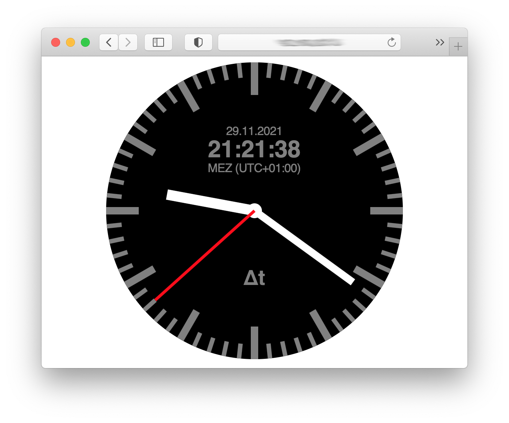

# WebSocket Clock



## Preface

There are a lot of web sites out there in the Internet that provide
clocks to include in a webpage. Most of them focus on design and
display the time of the local system clock of the user who visits
the webpage. That clock can be quite wrong.

That's why the Physikalisch-Technische Bundesanstalt in Braunschweig,
Germany, designed the WebSocket subprotocol 'Time' and runs a 
server for that protocol. This repository provides a script that
implements the client side of that protocol and controls clocks 
for different time scales on a webpage. 

## What clocks can be displayed?

The following clocks are available:

* Central European Time (CET, CEST)
* Universal Time Coordinated (UTC) that is world time
* Local Mean Time (LMT) of your location
* Greenwich Mean Sidereal Time (GMST)
* Local Mean Sidereal Time (LMST) of your location
* Julian Date (digital only)
* Modified Julian Date (digital only)
* Dublin Julian Day (digital only)

Additionally:

* Longitude that belongs to the displayed LMT or LMST


## Prerequisites

Some knowledge in HTML and embedded SVG is useful but not essential.

Javascript must be enabled.

No jQuery required.

## Installation

Put `webSocketClock.js` into some directory on your web server 
together with `simpleclock.html` from the `html` subdirectory of
this repository.

You can then open `simpleclock.html`, and the clock starts running.
Use parameters at the URL to control which kind of time is shown,
for example `simpleclock.html?tz=UTC` for UTC.

If you want to create your own clock design replace simpleclock.html
by an HTML file that includes the following:

```
    <script src="webSocketClock.js"></script>
    <script type="text/javascript">
      window.onload = function () {
        server_url = 'uhr.ptb.de/time'; // URL of the time server
        conf = {
          iso_date:false,             // date format
          longitude:13.040,           // longitude of the location
          UTC:{show:0,prefix:'ptb'},
          CET:{show:0,prefix:'ptb',name:'MEZ',offset:3600000,dst_name:'MESZ'},
          tz:{show:0,prefix:'ptb',name:'...',offset:...,dst_name:'...'},
          LMT:{show:0,prefix:'ptb',name:'LMT'},
          GMST:{show:0,prefix:'ptb'},
          LMST:{show:0,prefix:'ptb'}
        }
        webSocketClock(server_url,conf); }
    </script>
    <svg ...>
      <!-- your clock face here -->
    </svg>
```

All the elements in conf can be omitted. In this case defaults
take place. Replace the values in conf with values that meet your
requirements.

The element "show" describes what to be shown:

* 0 - nothing is shown
* 1 - digital without date
* 2 - analagous without date
* 3 - both without date
* 4 - date only
* 5 - digital with date
* 6 - analogous with date
* 7 - both with date

The element "prefix" needs to be set, if you have more than one
clock on one page, only. Otherwise, the element can be omitted
and the default "ptb" is used.

Examples for `conf`:

* Central European Time clock
  ```
  conf = {CET:{}};
  ```
  The IDs of the HTML elements start with 'ptb' (the default).
* UTC digital only
  ```
  conf = {UTC:{show:5}};
  ```
  The IDs of the HTML elements start with 'ptb'. To display the time, use:
  ```
  <span id="ptbTime">--:--:--</span><br/>
  <span id="ptbDate">--.--.----</span>
  ```
* two clocks, one showing LMT, the other LMST 
  ```
  conf = {LMT:{prefix:'lmt'},LMST:{prefix:'lmst'}};
  ```
  The IDs of the HTML elements for the LMT clock start with 'lmt',
  that of the LMST clock with 'lmst'. 

## Designing your own clock face

You may want to start with the command line tool `createClockFace.py`
in the `tools` directory. Start it as
```
createClockFace.py --help
```
to see the available options. After you saved the resulting output
to a file, you can further style the clock face.

## Links

* [Example Page showing the possibilities](https://www.woellsdorf-wetter.de/clock/astronomy.html)
* [PTB-Mitteilungen, 129. Jahrgang, Heft 4, Dezember 2019</a>, Seite 11ff.](https://www.ptb.de/cms/fileadmin/internet/publikationen/ptb_mitteilungen/mitt2019/PTB-Mitteilungen_2019_Heft_4.pdf)
* M. Gutbrod, T. Klein, D. Sibold: [WebSocket Subprotocol ‚Time‘](https://uhr.ptb.de/wst/paper). Physikalisch-Technische Bundesanstalt (PTB), Tech. Rep., 2017.
