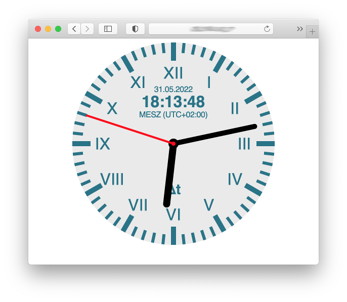
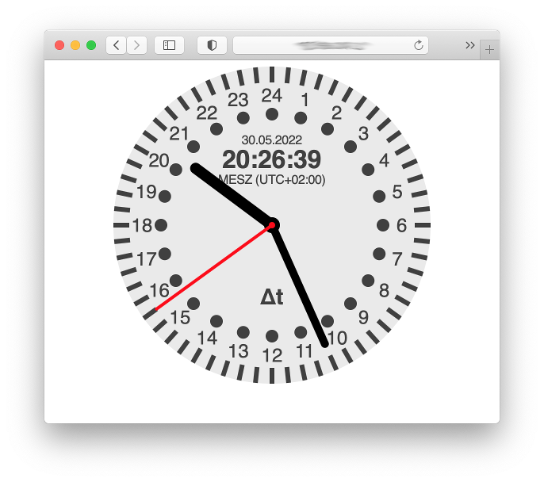

# WebSocket Clock


## Preface

There are a lot of web sites out there in the Internet that provide
clocks to include in a webpage. Most of them focus on design and
display the time of the local system clock of the user who visits
the webpage. That clock can be quite wrong.

That's why the Physikalisch-Technische Bundesanstalt in Braunschweig,
Germany, designed the WebSocket subprotocol 'Time' and runs a 
server for that protocol. This repository provides a script that
implements the client side of that protocol and controls clocks 
for different time scales on a webpage. 

This solution is GDPR complient. The server of the PTB is situated
in the EU, and no data other than the local system time is 
transmitted to the server. All calculation is done locally.

## What clocks can be displayed?

The following clocks are available:

* Central European Time (CET, CEST)
* Universal Time Coordinated (UTC) that is world time
* Local Mean Time (LMT) of your location
* Greenwich Mean Sidereal Time (GMST)
* Local Mean Sidereal Time (LMST) of your location
* Julian Date (digital only)
* Modified Julian Date (digital only)
* Dublin Julian Day (digital only)
* Relative Time (additional data needed)

Additionally:

* Longitude that belongs to the displayed LMT or LMST
* Length of the relative second

## Prerequisites

Some knowledge in HTML and embedded SVG is useful but not essential.

Javascript must be enabled.

No jQuery required.

## Installation

Put `webSocketClock.js` into some directory on your web server 
together with `simpleclock.html` from the `html` subdirectory of
this repository.

You can then open `simpleclock.html`, and the clock starts running.
Use parameters at the URL to control which kind of time is shown,
for example `simpleclock.html?tz=UTC` for UTC.

If you want to create your own clock design replace simpleclock.html
by an HTML file that includes the following:

```
    <script src="webSocketClock.js"></script>
    <script type="text/javascript">
      window.onload = function () {
        server_url = 'uhr.ptb.de/time'; // URL of the time server
        conf = {
          iso_date:false,             // date format
          longitude:13.040,           // longitude of the location
          UTC:{show:0,prefix:'ptb'},
          CET:{show:0,prefix:'ptb',name:'MEZ',offset:3600000,dst_name:'MESZ'},
          tz:{show:0,prefix:'ptb',name:'...',offset:...,dst_name:'...'},
          LMT:{show:0,prefix:'ptb',name:'LMT'},
          GMST:{show:0,prefix:'ptb'},
          LMST:{show:0,prefix:'ptb'},
          rel:{show:0,prefix:'ptb',url:'...'}
        }
        new WebSocketClock(server_url,conf); }
    </script>
    <svg ...>
      <!-- your clock face here -->
    </svg>
```

All the elements in conf can be omitted. In this case defaults
take place. Replace the values in conf with values that meet your
requirements.

The element "show" describes what to be shown:

* 0 - nothing is shown
* 1 - digital without date
* 2 - analagous without date
* 3 - both without date
* 4 - date only
* 5 - digital with date
* 6 - analogous with date
* 7 - both with date
* 16  - analogous 24 hour clock without date
* 17  - both digital and analogous 24 hour clock without date
* 20  - analogous 24 hour clock with date
* 21  - both digital and analogous 24 hour clock with date

values that can be or'ed or added with the other values:

* 8 - Microsoft Excel time
* 32 - full weekday name
* 64 - abbreviated weekday name

The element "prefix" needs to be set, if you have more than one
clock on one page, only. Otherwise, the element can be omitted
and the default "ptb" is used.

Examples for `conf`:

* Central European Time clock
  ```
  conf = {CET:{}};
  ```
  The IDs of the HTML elements start with 'ptb' (the default).
* UTC digital only
  ```
  conf = {UTC:{show:5}};
  ```
  The IDs of the HTML elements start with 'ptb'. To display the time, use:
  ```
  <span id="ptbTime">--:--:--</span><br/>
  <span id="ptbDate">--.--.----</span>
  ```
* two clocks, one showing LMT, the other LMST 
  ```
  conf = {LMT:{prefix:'lmt'},LMST:{prefix:'lmst'}};
  ```
  The IDs of the HTML elements for the LMT clock start with 'lmt',
  that of the LMST clock with 'lmst'. 

## Designing your own clock face

You may want to start with the command line tool `createClockFace.py`
in the `tools` directory. Start it as
```
createClockFace.py --help
```
to see the available options. After you saved the resulting output
to a file, you can further style the clock face.

Example: clock using roman numbers
```
sudo bash -c "tools/createClockFace.py --html --scale-style=line --scale-color=#267488 --digit=r,16px >/var/www/html/uhr.html"
```



## Relative Time

In ancient times people divided both the light day and the night
into 12 hours. Because sunrise and sunset vary in time, those
hours also varied in length during the year. In summer the day
hours were longer than the night hours, and vice versa in winter.
Therefore it is called relative time (in german "Temporalzeit").

So with that clock 00:00:00 is at the time of sunrise or sunset,
and 06:00:00 is at high noon or midnight local time.

To show that time, timestamps of sunrise and sunset are needed.
That data is not provided by the PTB, so you have to provide it
separately by a JSON file available for download. That JSON file
must contain an array of sunset and sunrise timestamps, starting
with a sunset in the past. 

For example, that kind of time was used in ancient Israel. So
you find such time data in the Bible. The time was used until the
middle ages. So the Prague city hall clock shows this time.

## IDs

If you set up a prefix other than `ptb`, replace "ptb" by the prefix
you set up in configuration.

ID | description
---|-------------
`clockLongitude` | longitude for the local time
`ptbRelativeSecond` | length of the relative second in solar seconds
`ptbFaceBackground` | background color of the clock face
`ptbNotice` | connection state and error message
`ptbTabDeviation` | deviation display area (used to switch display state)
`ptbLinkDeviation` | button to switch on deviation display
`ptbDeviationTitle` | tool tip for deviation display
`ptbDeviation` | deviation display area (used to switch display state)
`ptbOffset` | actual deviation text of the clock 
`ptbAccuracy` | actual accuracy text
`ptbDate` | date text
`ptbWeekday` | weekday text
`ptbTime` | digital time text
`ptbLocalTimezone` | time zone in effect
`ptbHour24Hand` | direction of a hand with 1 turn in 24 hours
`ptbHourHand` | direction of the hour hand
`ptbMinuteHand` | direction of the minute hand
`ptbSecondHand` | direction of the second hand
`ptbExcelTimeZone` | timezone of the Microsoft Excel time 
`ptbExcelTime` | Microsoft Excel time (based on local timezone)
`JDUTC` | Julian Date (UTC)
`MJDUTC` | Modified Julian Date (UTC)
`DJDUTC` | Dublin Julian Day (UTC)
`UnixEpoch` | UNIX epoch time (based on UTC)
`LabViewTime` | National Instrument's LabView time (based on UTC)

## Weekday

To display the weekday the following values can be or'ed or added
to the values in the `show` element:

* +32 - full weekday name
* +64 - abbreviated weekday name

example configuration:

```
conf = {cet:{show:7+32}};
```

Within the clock face you need a text element with the ID
`ptbWeekday`. "ptb" has to replaced by the prefix you set, if any.

The weekday is displayed according to the language setting of
the user's browser. This is done by using the Javascript function
`toLocaleString()` for all languages except german. The german
weekday names are set in the element `weekdays` of `WebSocketClock`
and can be changed there if necessary (for example if you want
to set it to some dialect form).

## 24 Hour Clock

You can also create a clock with its hour hand turning once in a
day only. To do so set `show` to 21 in the configuration. In the
clock face replace the ID of the hour hand to `ptbHour24Hand`.
To create such a clock face you can use `createClockFace.py`
with the option `--24`



It is also possible to have both a 24-hour hand and a 12-hour
hand in the same clock for specially designed clock faces. 
The option `show` is 22 in that case. An example would be
an additional sun symbol turning around during the day while
the normal hour hand shows the time.

## Links

* [Example Page showing the possibilities](https://www.woellsdorf-wetter.de/clock/astronomy.html)
* [PTB-Mitteilungen, 129. Jahrgang, Heft 4, Dezember 2019</a>, Seite 11ff.](https://www.ptb.de/cms/fileadmin/internet/publikationen/ptb_mitteilungen/mitt2019/PTB-Mitteilungen_2019_Heft_4.pdf)
* M. Gutbrod, T. Klein, D. Sibold: [WebSocket Subprotocol ‚Time‘](https://uhr.ptb.de/wst/paper). Physikalisch-Technische Bundesanstalt (PTB), Tech. Rep., 2017.
